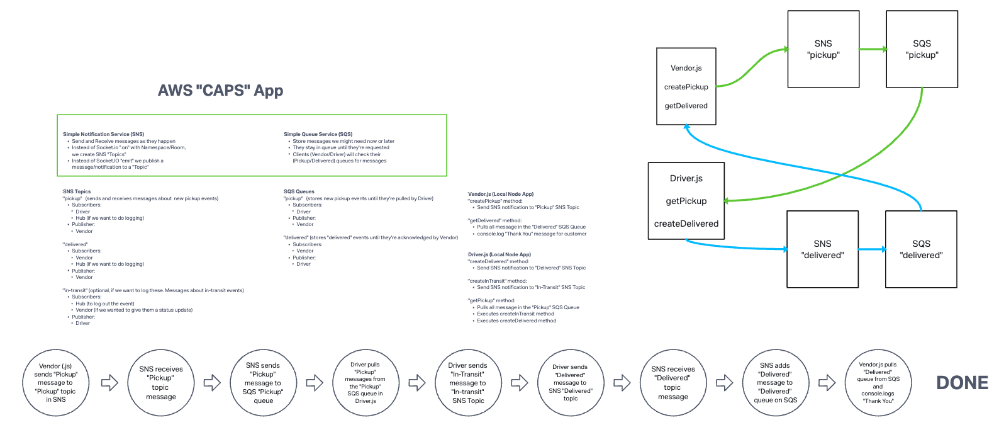

# CAPS-Cloud

CAPS-Cloud is a cloud-based delivery system that leverages AWS services to manage and track package deliveries. It uses AWS Simple Queue Service (SQS) and Simple Notification Service (SNS) to handle the communication between vendors and drivers.

## Overview

The system is designed to simulate a real-world delivery scenario where vendors post pickup requests and drivers deliver the packages. The communication between vendors and drivers is managed through AWS SNS and SQS, ensuring the delivery process is orderly and efficient.

## UML

The UML for this project was done primarily by Josh E, with me on the huddle.

## Tech Stack

- AWS Simple Queue Service (SQS)
- AWS Simple Notification Service (SNS)
- Node.js

## Features

- Vendors can post "pickup" messages containing delivery information into the SNS **pickup** topic.
- Pickup requests are moved into a SQS FIFO Queue called **packages** for the drivers automatically.
- Vendors can subscribe to their personal SQS Standard Queue and periodically poll the queue to see delivery notifications.
- Drivers can poll the SQS **packages** queue and retrieve the delivery orders (messages) in order.
- Drivers can post a message to the Vendor specific SQS Standard Queue using the `queueUrl` specified in the order object after a certain time.

## How to Use

1. Set up your AWS SNS and SQS services according to the specifications mentioned in the document.
2. Clone the repository and install the dependencies using `npm install`.
3. Run `vendor.js` to start the vendor application. This will start posting pickup messages to the SNS topic and poll the vendor's queue for delivery notifications.
4. Run `driver.js` to start the driver application. This will start polling the packages queue for delivery orders and post delivery notifications to the vendor's queue.
5. Monitor the console logs to track the delivery process.

## Conclusion

CAPS-Cloud is a robust and scalable delivery system that makes efficient use of AWS services. It provides a practical demonstration of how cloud services can be used to manage and streamline complex processes.